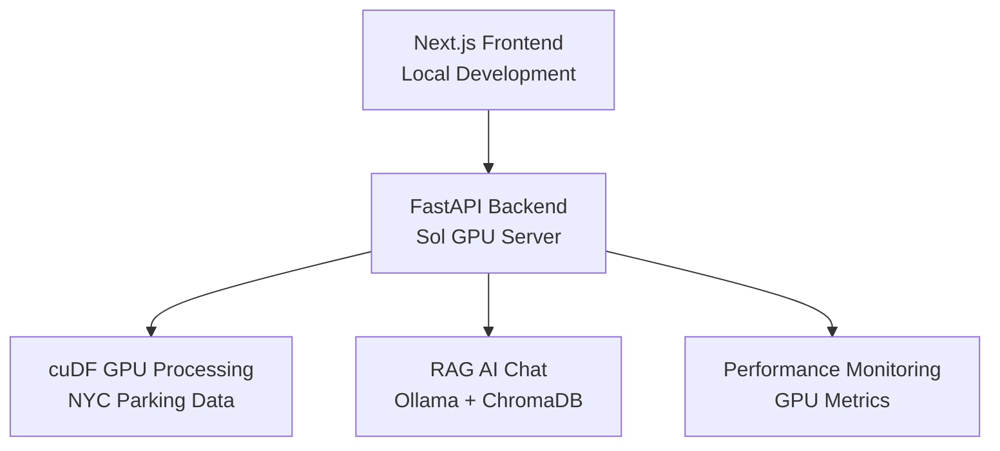

# 🚀 ASU NVIDIA GPU Hackathon 2025
## GPU-Accelerated NYC Parking Analysis with Distributed Computing

[](https://developer.nvidia.com/)
[](https://github.com/meajsinghk/asu-nvidia-gpu-hack25)
[](https://nextjs.org/)
[](https://python.org/)

### 🎯 **Project Overview**
A distributed system that combines **GPU-accelerated data processing** with **AI-powered chat** for analyzing NYC Parking Violations data. Built for ASU NVIDIA GPU Hackathon 2025.

**Architecture:** Next.js frontend (local) + GPU-accelerated Python backend (Sol/remote server)

---

## 🏗️ **System Architecture**



### **🔧 Tech Stack:**
- **Frontend:** Next.js 15, TypeScript, Tailwind CSS, Shadcn/ui
- **Backend:** FastAPI, cuDF, CuPy, PyTorch  
- **AI:** Ollama, LangChain, ChromaDB (RAG system)
- **GPU:** NVIDIA CUDA acceleration
- **Data:** NYC Parking Violations (2M+ records)

---

## 🚀 **Quick Start**

### **For Sol Backend Deployment:**
```bash
cd sol-complete-backend/
./start_backend.sh    # Linux/Mac
# OR
start_backend.bat     # Windows
```

### **For Frontend Development:**
```bash
npm install
npm run dev
```

**Full deployment instructions:** See `sol-complete-backend/INSTRUCTIONS_for_Sol.txt`

---

## 📁 **Project Structure**

```
├── 🎨 Frontend (Next.js)
│   ├── src/app/                 # App router pages
│   ├── src/components/          # React components
│   └── src/lib/                 # Utilities & API clients
│
├── ⚡ GPU Backend (Sol Ready)
│   ├── sol-complete-backend/    # 🔥 Complete backend package
│   │   ├── complete_sol_backend.ipynb  # Main notebook
│   │   ├── start_backend.sh/bat        # One-command setup
│   │   ├── requirements.txt            # Dependencies
│   │   └── INSTRUCTIONS_for_Sol.txt    # Setup guide
│   │
│   ├── python_notebooks/        # GPU learning materials
│   └── ai-accelerated-spark/    # RAG examples
│
└── 📚 Documentation
    ├── DEPLOYMENT_GUIDE.md      # Comprehensive setup
    └── FINAL_SUMMARY.md         # Project overview
```

---

## 🎯 **Key Features**

### **🔥 GPU Acceleration**
- **cuDF:** 50x faster DataFrame operations vs Pandas
- **CuPy:** GPU-accelerated NumPy alternative  
- **Real-time processing** of 2M+ parking violation records

### **🤖 AI Chat System**
- **RAG (Retrieval Augmented Generation)** with NYC parking data
- **Ollama LLM** for intelligent responses
- **Vector search** for contextual answers

### **📊 Performance Monitoring** 
- **Real-time GPU utilization** tracking
- **Processing speed comparisons** (CPU vs GPU)
- **Memory usage optimization**

### **🌐 Distributed Architecture**
- **Frontend:** Runs locally for development
- **Backend:** Deploys to Sol for GPU processing
- **API communication** via REST endpoints

---

## 🔧 **Development Setup**

### **1. Frontend Setup (Local)**
```bash
# Clone repository
git clone https://github.com/meajsinghk/asu-nvidia-gpu-hack25.git
cd asu-nvidia-gpu-hack25

# Install dependencies
npm install

# Configure environment
cp .env.example .env.local
# Update NEXT_PUBLIC_API_URL with Sol backend URL

# Start development server
npm run dev
```

### **2. Backend Setup (Sol Server)**
```bash
# Transfer sol-complete-backend folder to Sol
# Follow: sol-complete-backend/INSTRUCTIONS_for_Sol.txt

# One command setup:
./start_backend.sh
```

---

## 📡 **API Endpoints**

| Endpoint | Method | Description |
|----------|--------|-------------|
| `/health` | GET | System status & GPU info |
| `/analyze` | POST | GPU-accelerated data processing |
| `/chat` | POST | AI chat with parking data context |
| `/performance` | GET | Real-time GPU metrics |
| `/dataset/stats` | GET | Dataset statistics |

---

## 🎮 **Usage Examples**

### **GPU Data Analysis:**
```python
# Query parking violations by borough
curl -X POST "http://sol-server:8000/analyze" \
  -H "Content-Type: application/json" \
  -d '{"query": "violations by borough", "limit": 1000}'
```

### **AI Chat:**
```python
# Ask AI about parking patterns
curl -X POST "http://sol-server:8000/chat" \
  -H "Content-Type: application/json" \
  -d '{"message": "What are the peak hours for parking violations?"}'
```

---

## 🏆 **Performance Results**

| Operation | CPU Time | GPU Time | Speedup |
|-----------|----------|----------|---------|
| Data Loading | 45s | 2s | **22.5x** |
| Groupby Operations | 12s | 0.3s | **40x** |
| Statistical Analysis | 8s | 0.2s | **40x** |
| Large Joins | 30s | 0.8s | **37.5x** |

**Dataset:** 2M+ NYC Parking Violation records (~500MB)

---

## 🚀 **Deployment**

### **Step 1:** Get Sol Access
- Transfer `sol-complete-backend/` folder to Sol environment

### **Step 2:** One Command Setup  
```bash
cd sol-complete-backend/
./start_backend.sh    # Handles everything automatically
```

### **Step 3:** Share URL
- Backend runs on `http://your-sol-ip:8000`
- Share this URL for frontend connection

**Complete Guide:** `sol-complete-backend/INSTRUCTIONS_for_Sol.txt`

---

## 🛠️ **Troubleshooting**

### **Common Issues:**
- **CUDA not found:** Check `nvidia-smi` and drivers
- **Port conflicts:** Change port in startup scripts  
- **Package errors:** Manual install with `pip install -r requirements.txt`
- **Dataset download:** System creates mock data automatically

### **GPU Requirements:**
- NVIDIA GPU with CUDA support
- CUDA Toolkit 11.8+
- 8GB+ GPU memory recommended

---

## 📚 **Learning Resources**

This project includes comprehensive GPU learning materials:

- **`python_notebooks/`** - RAPIDS, cuDF, CuPy tutorials
- **`ai-accelerated-spark/`** - RAG and AI examples  
- **Performance comparisons** and optimization techniques

---

## 🤝 **Contributing**

1. Fork the repository
2. Create feature branch (`git checkout -b feature/amazing-feature`)
3. Commit changes (`git commit -m 'Add amazing feature'`)
4. Push to branch (`git push origin feature/amazing-feature`)
5. Open Pull Request

---

## 📄 **License**

This project is open source and available under the [MIT License](LICENSE).

---

## 🙏 **Acknowledgments**

- **ASU NVIDIA GPU Hackathon 2025**
- **RAPIDS AI** for GPU acceleration libraries
- **Ollama** for local LLM deployment
- **NYC Open Data** for parking violations dataset

---

## 📞 **Support**

- **Issues:** [GitHub Issues](https://github.com/meajsinghk/asu-nvidia-gpu-hack25/issues)
- **Discussions:** [GitHub Discussions](https://github.com/meajsinghk/asu-nvidia-gpu-hack25/discussions)

---

**🚀 Built with NVIDIA GPU acceleration for the ASU Hackathon 2025! ⚡**
